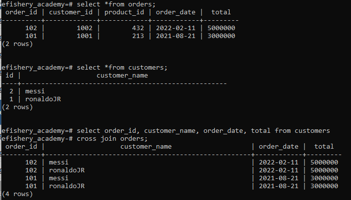

## Insert tabel customers

## Insert tabel orders

## Insert tabel products

## Delete untuk tabel customers

## Delete untuk tabel orders

## Delete untuk tabel products

## Update untuk tabel customers

## Update untuk tabel orders

## Update untuk tabelproducts

## Cross join tabel orders dengan customers

